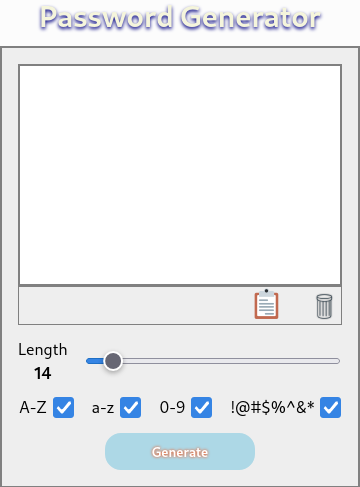
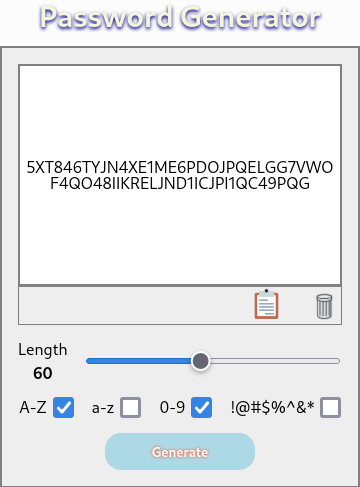

# Password generator app

Apliación que genera contraseña aleatoriamente.

Utiliza librería React y CSS.


<div id="imagenes">
    
    
    

</div>
<style>
    #imagenes: {
        width: 100%;
        display: flex;
        flex-direction: row;
        flex-wrap: wrap;
        column-gap: 1rem;
    }
    #imagenes img {
        width: 150px;
        height: 200px;
    }
</style>


Permite:
* Copiar la contraseña generada o borrarla del portapapeles.
* Seleccionar la longitud de la contraseña.
* Seleccionar los grupos de carácteres que se utilizarán.

Diseño responsivo.


## ¿Cómo usar?


Copiar el repositorio
```
$ git clone --branch passwordgen URL
```

Instalar modulos
```
$ npm install
```

Ejecutar la aplicación
```
$ npm start
```
